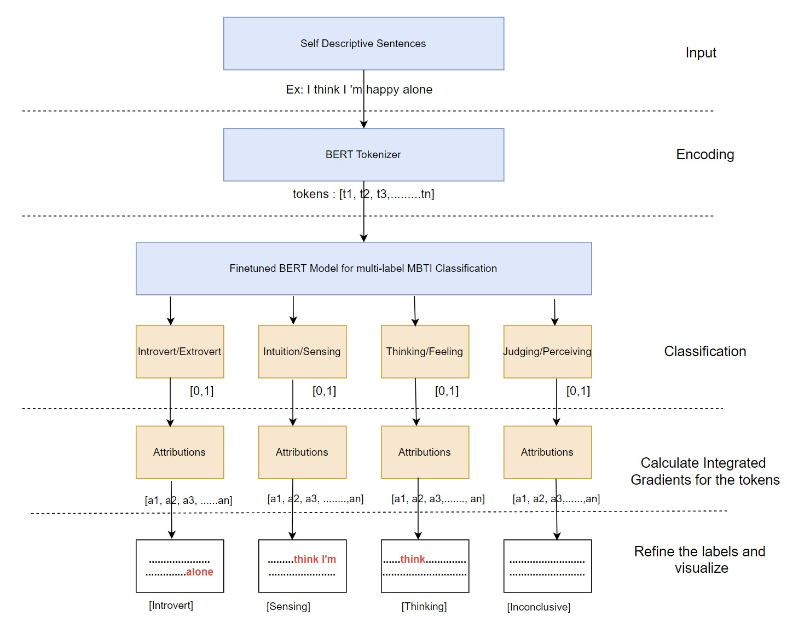

# 🧠 MBTI Personality Inference API

A FastAPI-based inference service that predicts **MBTI personality types** from text input using a fine-tuned BERT model.

<p align="center">
  
</p>

---

## 🧬 Project Overview

This project demonstrates a containerized machine learning inference service using a custom fine-tuned model on the **MBTI (Myers-Briggs Type Indicator)** classification task.

Unlike traditional sentiment analysis, this project aims to **analyze personality traits** expressed in language using BERT.

- **Model:** `ClaudiaRichard/mbti-bert-nli-finetuned`
- **API Framework:** FastAPI
- **Containerization:** Docker
- **Deployment-ready:** Scalable via `uvicorn` workers

---

## 🤖 MBTI Dimensions

| Code | Description |
|------|-------------|
| I / E | Introversion / Extraversion |
| N / S | Intuition / Sensing |
| T / F | Thinking / Feeling |
| J / P | Judging / Perceiving |

---

## Architecture

<p align="center">
  
</p>


---

## 🚀 Quickstart with Docker

### 1. Clone the Repo

```bash
git clone https://github.com/claudiarichardxx/huggingface-inference.git
cd huggingface-inference
```

### 2. Build the Docker Image

```bash
docker build -t mbti_inference_api .
```

### 3. Run the Container

```bash
docker run -p 8000:8000 mbti_inference_api
```

The API will be available at: [http://localhost:8000/docs](http://localhost:8000/docs)

---

## 🧪 API Usage

### Endpoint 1

```http
GET /predict
```

### Request Body

```json
{
  "text": "I'm pretty outdoorsy. I like travelling with friends and family.",
  "model": "ClaudiaRichard/mbti_classification_v2"
}
```

### Response

```json
{
    "labels": [
        "Introvert",
        "Intuition",
        "Thinking",
        "Perceiving"
    ],
    "mbti": "INTP",
    "refined_labels": [
        "Inconclusive",
        "Intuition",
        "Thinking",
        "Perceiving"
    ],
    "attribution_values": {
        "Introvert_Extrovert": {
            "[CLS]": 0.4442,
            "i": 0.3767,
            "'": -0.2885,
            "m": 0.0097,
            "pretty": 0.1235,
            "outdoors": 0.2461,
            "##y": 0.327,
            ".": 0.3068,
            "like": 1.0,
            "travelling": 0.3235,
            "with": -0.0628,
            "friends": 0.1662,
            "and": 0.2692,
            "family": 0.0043,
            "[SEP]": -0.2136
        },
        "Intuition_Sensing": {
            "[CLS]": 0.2277,
            "i": -0.398,
            "'": -0.5432,
            "m": -0.4806,
            "pretty": -0.2263,
            "outdoors": 0.575,
            "##y": 0.1851,
            ".": 0.3294,
            "like": 0.7846,
            "travelling": 0.1436,
            "with": -0.5545,
            "friends": -0.2079,
            "and": -0.4947,
            "family": 0.7007,
            "[SEP]": -1.0
        },
        "Thinking_Feeling": {
            "[CLS]": -0.0874,
            "i": -1.0,
            "'": -0.5907,
            "m": -0.6658,
            "pretty": -0.6422,
            "outdoors": -0.2171,
            "##y": -0.6462,
            ".": -0.2067,
            "like": -0.0752,
            "travelling": -0.5225,
            "with": -0.6991,
            "friends": -0.6012,
            "and": -0.3092,
            "family": 0.0117,
            "[SEP]": -0.872
        },
        "Judging_Perceiving": {
            "[CLS]": 0.2954,
            "i": 0.3441,
            "'": -0.2936,
            "m": 0.2628,
            "pretty": 0.5601,
            "outdoors": 0.7466,
            "##y": 0.229,
            ".": 0.4509,
            "like": 1.0,
            "travelling": 0.4049,
            "with": -0.4434,
            "friends": -0.0749,
            "and": 0.1715,
            "family": 0.4505,
            "[SEP]": -0.2653
        }
    }
}
```

> The response includes both full trait labels and the 4-letter MBTI code.


### Endpoint 2

```http
POST /train
```

### Request Body

```json
{
    "base_model": "prajjwal1/bert-tiny",
    "dataset_name": "ClaudiaRichard/mbti_classification_v2",
    "finetuned_model_name": "test"
}
```

### Response

```json
{
    "history": {
        "train_runtime": 30.349,
        "train_samples_per_second": 10.544,
        "train_steps_per_second": 0.659,
        "total_flos": 63563980800.0,
        "train_loss": 0.6761322021484375,
        "epoch": 20.0
    },
    "test_results": {
        "eval_loss": 0.6896672248840332,
        "eval_f1": 0.0,
        "eval_roc_auc": 0.5,
        "eval_runtime": 0.0719,
        "eval_samples_per_second": 139.106,
        "eval_steps_per_second": 27.821,
        "epoch": 20.0
    }
}
```
---

## 📦 Requirements

Listed in `requirements.txt`:

```txt
fastapi
uvicorn
transformers
torch
pydantic
...
```

Installed automatically inside the Docker container.

---

## 🧠 Model Details

- Hugging Face: [`ClaudiaRichard/mbti-bert-nli-finetuned`](https://huggingface.co/ClaudiaRichard/mbti-bert-nli-finetuned)
- Fine-tuned on personality-labeled forum data
- Multi-label classification (one label from each of the four MBTI dimensions)

---

## 🛠 Project Structure

```
huggingface-inference/
│
├── app/
│   └── main.py          -> FastAPI app and model logic
├── requirements.txt     -> Python dependencies
├── dockerfile           -> Image definition
├── utils
    |── attributions.py  -> Calculate attributions
    |── predict.py       -> Making predictions
    |── train.py         -> Finetuning model
├── .gitignore           -> Files for git to ignore
├── logger.py            -> Initialize logger
└── README.md            -> You are here
```

---


## 🙌 Author

**Claudia Richard**  
[GitHub: @claudiarichardxx](https://github.com/claudiarichardxx)  
Exploring personality through language and machine learning.

---

## 🧠 Just for Fun

> "Tell me something about yourself and I'll guess your personality."

That’s what this app does — powered by transformers.
