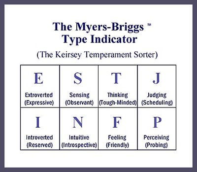

# 🧠 MBTI Personality Inference API

A FastAPI-based inference service that predicts **MBTI personality types** from text input using a fine-tuned BERT model.



---

## 🧬 Project Overview

This project demonstrates a containerized machine learning inference service using a custom fine-tuned model on the **MBTI (Myers-Briggs Type Indicator)** classification task.

Unlike traditional sentiment analysis, this project aims to **analyze personality traits** expressed in language using BERT.

- **Model:** `ClaudiaRichard/mbti-bert-nli-finetuned`
- **API Framework:** FastAPI
- **Containerization:** Docker
- **Deployment-ready:** Scalable via `uvicorn` workers
- **Demo:** Parallel POST requests via a Jupyter Notebook

---

## 🤖 MBTI Dimensions

| Code | Description |
|------|-------------|
| I / E | Introversion / Extraversion |
| N / S | Intuition / Sensing |
| T / F | Thinking / Feeling |
| J / P | Judging / Perceiving |

---

## 🚀 Quickstart with Docker

### 1. Clone the Repo

```bash
git clone https://github.com/claudiarichardxx/huggingface-inference.git
cd huggingface-inference
```

### 2. Build the Docker Image

```bash
docker build -t mbti_inference_api .
```

### 3. Run the Container

```bash
docker run -p 8000:8000 mbti_inference_api
```

The API will be available at: [http://localhost:8000/docs](http://localhost:8000/docs)

---

## 🧪 API Usage

### Endpoint

```http
POST /predict
```

### Request Body

```json
{
  "text": "I really enjoy being alone these days."
}
```

### Response

```json
{
  "labels": ["Introvert", "Intuition", "Feeling", "Perceiving"],
  "mbti": "INFP"
}
```

> The response includes both full trait labels and the 4-letter MBTI code.

---

## 📓 Demo Notebook

A notebook `mbti_demo.ipynb` is included to demonstrate:

- Sending multiple concurrent inference requests
- Benchmarking response times
- Analyzing results across diverse text inputs

```bash
jupyter notebook
```

Make sure the API container is running on port `8000`.

---

## 📦 Requirements

Listed in `requirements.txt`:

```txt
fastapi
uvicorn
transformers
torch
pydantic
```

Installed automatically inside the Docker container.

---

## 🧠 Model Details

- Hugging Face: [`ClaudiaRichard/mbti-bert-nli-finetuned`](https://huggingface.co/ClaudiaRichard/mbti-bert-nli-finetuned)
- Fine-tuned on personality-labeled forum data
- Multi-label classification (one label from each of the four MBTI dimensions)

---

## 🛠 Project Structure

```
huggingface-inference/
│
├── app/
│   └── main.py          ← FastAPI app and model logic
├── requirements.txt     ← Python dependencies
├── dockerfile           ← Image definition
├── demo.ipynb      ← Notebook for testing the API
└── README.md            ← You are here
```

---


## 🙌 Author

**Claudia Richard**  
[GitHub: @claudiarichardxx](https://github.com/claudiarichardxx)  
Exploring personality through language and machine learning.

---

## 🧠 Just for Fun

> "Tell me something about yourself and I'll guess your personality."

That’s what this app does — powered by transformers.